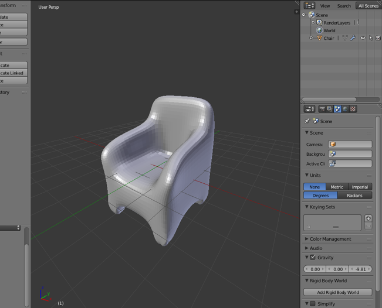
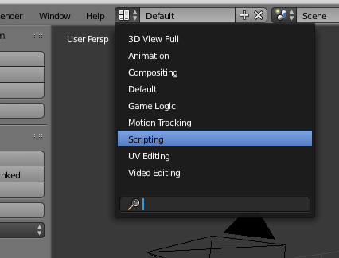
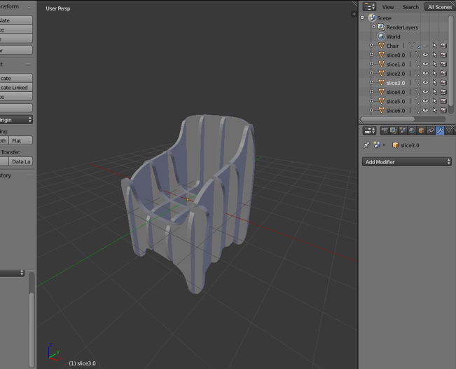
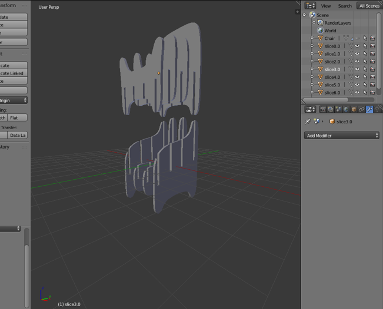

# Sly

A Python library for 3D construction from 2D parts. 

Sly is still undergoing heavy development, and you may find that
things are broken. If you run into a problem, 
[open an issue!](https://github.com/meshulam/sly/issues)

## Installation

### Dependencies

Sly has two external dependencies:

* [Blender](http://www.blender.org/) of course; version 2.71 or later.
* [GEOS](http://trac.osgeo.org/geos/) - High performance geometry
  functions. Can be installed via Yum/Apt/Homebrew/etc. 
  Seems the only Windows binary is through [OSGeo4W](http://trac.osgeo.org/osgeo4w/).

### Installing Sly into Blender

1. Download the latest sly-addon.zip zipfile from the 
   [releases page](https://github.com/meshulam/sly/releases)
2. Open the Blender preferences and go to the *Add-ons* tab
3. Click *Install from File...* at the bottom and select the
   zipfile you downloaded.
4. Restart Blender

If you want to generate the zipfile from source, clone this repository
and run `make`. The resulting archive is at `build/sly-addon.zip`.
At the moment the "build" just consists of moving some files around
and zipping them up. In the future it might also download the latest versions
of dependencies or do platform-specific build stuff. But for now it doesn't
do much.

Note that Sly also depends on some Python modules that Blender provides. 
This means that for now, Sly only works from inside Blender. In the future
I'd like to have some way of running it standalone, but that's not possible
yet.

## Usage

### Preparing the model

Open a Blender project which contains a mesh object that you'd like to 
convert into slices. To prevent weird behavior, your mesh must be manifold 
(watertight). To find potentially problematic areas, go into edit mode, make
sure no elements are selected, and do *Select* > *Non Manifold*. 

### Loading a template script

Open a text editor area. The easiest way to do this is to switch to the
pre-defined *Scripting* layout in the dropdown at the top of the Blender
window:

Click "New" in the text editor and paste in the contents of the example
script, available at
[example/starter.py](https://raw.githubusercontent.com/meshulam/sly/master/example/starter.py) 
in this repo.

### Modifying the script for your model

The [starter script](https://raw.githubusercontent.com/meshulam/sly/master/example/starter.py) 
has documentation for most of Sly's functionality. Modify
the values or uncomment sections as desired. When you save your project, the
script will be saved as part of the .blend file. You can also save it to an
external file from *Text* > *Save As*.

### Running the script

In object mode, select just the one mesh object that you want Sly to work with.
Then, in the script area, run the script from the right-click menu or the 
"Text" menu at the bottom. 

Ta-da! You just sliced your model!

In the sample script, each slice is added back into your Blender scene as a
separate object. 

If configured, the script also exports an SVG file with the 2D slice shapes. 
This SVG can then be imported into various CNC routing tools
so you can cut out the shapes.

